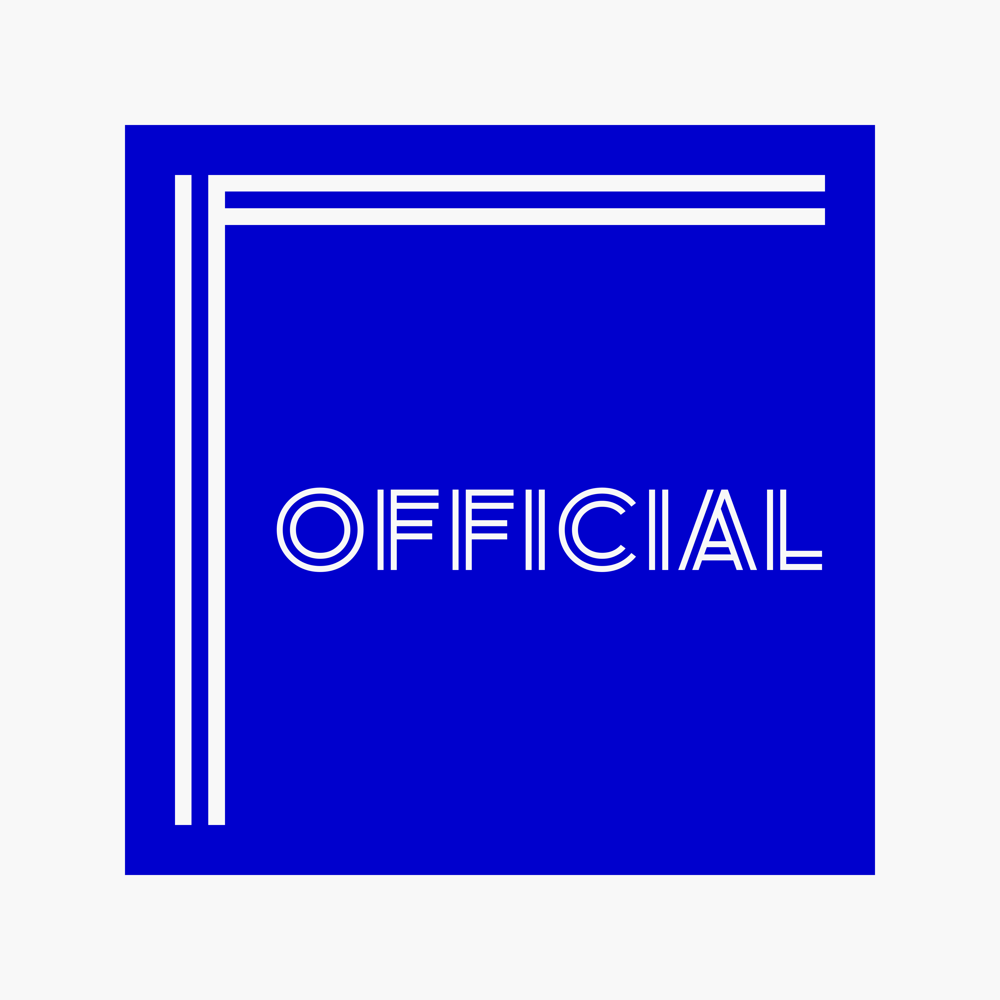

# official

[](https://github.com/uyupun/official/actions/workflows/chromatic.yml)



ぅゅ...ぷんぽぷんぽ公式Webサイト

## 環境構築

```bash
# クローン
$ git clone https://github.com/uyupun/official.git

# ディレクトリを移動
$ cd official

# パッケージのインストール
$ yarn install
```

## コマンド一覧

```bash
# ローカルサーバの起動(localhost:3000)
$ yarn dev

# ビルドの実行
$ yarn build

# 本番モードで起動
$ yarn start

# ESLintの実行
$ yarn lint:eslint

# Prettierの実行
$ yarn lint:prettier

# ls-lintの実行
$ yarn lint:ls

# ESLintの実行と問題の自動修正
$ yarn fix:eslint

# Prettierの実行と問題の自動修正
$ yarn fix:prettier

# ステージング環境にあるファイルに対して、ESLintとPrettierを実行
$ yarn lint-staged

# yarn install後に実行され、huskyをインストールする
$ yarn prepare

# Storybookの起動(localhost:6006)
$ yarn storybook

# Storybookのビルド
$ yarn build-storybook

# pathpidaの実行
$ yarn pathpida

# アイコンコンポーネントの生成
$ yarn icons

# /public/images 以下のディレクトリ内にある png または jpg(jpeg) ファイルを元に画像を生成
$ yarn images
```

## OGPの検証

- OGPをローカル開発環境で検証する場合、一時的にインターネットに公開する必要があるため、ngrokを用いる

```bash
# ngrokのインストール
$ brew install ngrok

# 認証トークンの設定
$ ngrok config add-authtoken <your authtoken>

# ローカルサーバの起動(localhost:3000)
$ yarn dev

# ngrokの実行
$ ngrok http 3000

# ngrokでプロキシされたリンクを開く
$ open https://xxxx.jp.ngrok.io

# Web UIを開く
$ open http://localhost:4040
```

## 使用技術

### 開発環境

- [Next.js](https://nextjs.org)
- [TypeScript](https://www.typescriptlang.org)

### コンポーネントカタログ

- [Storybook](https://storybook.js.org)

### リンター、フォーマッター

- [ESLint](https://eslint.org)
- [Prettier](https://prettier.io)
- [ls-lint](https://ls-lint.org)

### スタイリング

- [modern-css-reset](https://github.com/hankchizljaw/modern-css-reset)
- [vanilla-extract](https://vanilla-extract.style)
  - [Sprinkles](https://vanilla-extract.style/documentation/packages/sprinkles)
  - [Recipes](https://vanilla-extract.style/documentation/packages/recipes)

### CSS設計

- [BEM](https://en.bem.info)

### コンポーネント設計

- [BCCD Design](https://qiita.com/misuken/items/19f9f603ab165e228fe1)

### アイコン

- [Material Icons](https://fonts.google.com/icons?icon.set=Material+Icons)

### フォーム

- [React Hook Form](https://react-hook-form.com/)

### バリデーション

- [Zod](https://zod.dev/)

## 参照

- [Figma](https://www.figma.com/file/24u8W1q18DksKv8UmgUhpv/official)
- [Chromatic](https://www.chromatic.com/builds?appId=61fbd2ebd69c46003acc2b93)
